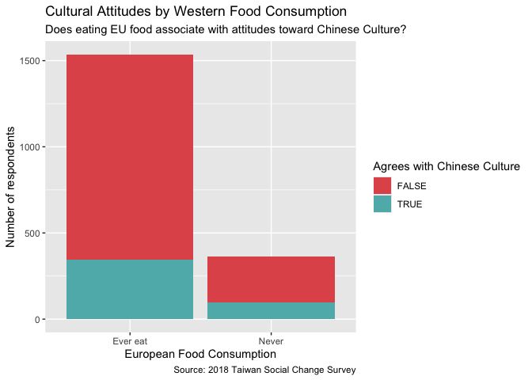
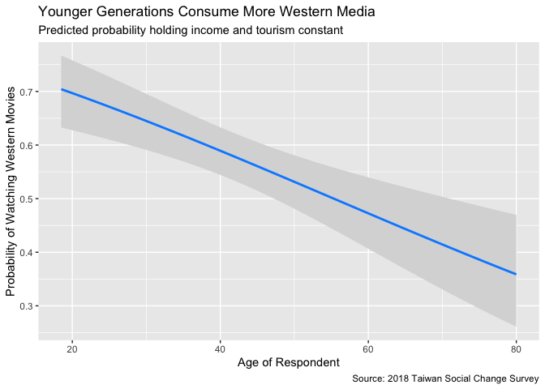

Cultural Dynamics and Global Media Consumption in Taiwan
================
Richie Peng

# 1. Introduction

## Background

Taiwanese society exhibits a unique co-existence of rich traditional
Chinese cultural roots and rapid integration into Western globalization.
As modernization accelerates, individuals are increasingly exposed to
foreign lifestyles, western dietary habits, and international travel.
Understanding how these global forces interact with domestic values is a
core question in sociology and cultural studies. This project uses
empirical data from the **2018 Taiwan Social Change Survey** to
quantitatively evaluate how Taiwanese cultural preferences and media
consumption are shaped by personal socio-demographic backgrounds and
lifestyle choices.

## Purpose

The primary purpose of this project is to analyze the factors
influencing two key aspects of cultural dynamics in Taiwan: 1.
**Traditional Cultural Appreciation**: The perceived importance of
traditional Chinese history and culture. 2. **Western Media
Consumption**: The habit of watching Western movies.

By utilizing **logistic regression** modeling, we examine whether a
“digital and cultural divide” exists across age, gender, income levels,
and urbanization types, and investigate whether lifestyle proxies (like
eating European food or international travel) drive shifts in cultural
values.

## Goals

- Build and interpret multiple binary **logistic regression** models
  using the `glm()` function in R to analyze binary outcomes of cultural
  preferences.
- Evaluate the impact of demographic factors (Age, Gender, Income, and
  Urbanization) on traditional and globalized preferences.
- Examine the behavioral effects of Western dietary habits and
  international tourism as external factors of attitude shifts.
- Use `ggplot2` and `visreg` to create professional visualizations that
  illustrate the predictive probabilities and demographic trends of
  cultural consumption.

## Techs and Skills

- **Programming Language**: R
- **Libraries Used**: `dplyr` (data wrangling), `ggplot2` (advanced data
  visualization), `visreg` (regression visualization)
- **Statistical Methods**: Binary **logistic regression** modeling
  (`glm` with `binomial` family and `logit` link), demographic control
  analysis, and hypothesis testing.

## Data Source & Accessibility

* **Dataset**: Taiwan Social Change Survey (TSCS) - 2018 (Round 7, Year 4: Globalization and Culture)
* **Survey Institution**: Institute of Sociology, Academia Sinica (中央研究院社會學研究所)
* **Access Policy**: In compliance with academic licensing and data distribution agreements from the Survey Research Data Archive (SRDA), the raw dataset (`.rda` / `.csv`) is not hosted in this repository. 

------------------------------------------------------------------------

# 2. TL;DR

## Basic Information

- **Dataset**: 2018 Taiwan Social Change Survey
- **Methodology**: Two primary investigations modeled via binary
  **logistic regression** to estimate log-odds and predictive
  probabilities of cultural attitudes and consumption.

## Key takeaways

- **Traditional Chinese History and Culture Appreciation**:
  - Demographics play a significant role. **Female** respondents
    (Estimate = -0.2938, `p-value` = 0.0255) and individuals with
    **higher income** (Estimate = -0.0244, `p-value` = 0.0133) are
    significantly less likely to agree with the importance of
    traditional Chinese culture.
  - Western food consumption (eating European food) was tested as a
    potential lifestyle cause, but it does **not** have a statistically
    significant effect on cultural appreciation (Estimate of
    `EUfoodNever` = 0.1046, `p-value` = 0.4707) when controlling for age
    and gender.
- **Western Movies Consumption**:
  - A stark demographic and cultural divide is evident. **Younger**
    (Estimate = -0.0358, `p-value` \< 0.001) and **wealthier** (Estimate
    = 0.0284, `p-value` \< 0.001) individuals, as well as **males**
    (Female Estimate = -0.4454, `p-value` \< 0.001), are significantly
    more likely to watch Western movies.
  - Urbanization presents a clear divide: residents in **Cities**
    (Estimate = -0.6956, `p-value` \< 0.001) and **Villages** (Estimate
    = -1.0790, `p-value` \< 0.001) consume significantly less Western
    media compared to those living in the **Metropolis** reference
    group.
  - **International Tourism** is a powerful behavioral driver. Having
    traveled abroad significantly increases the log-odds of watching
    Western movies (Estimate of `TourismForeign` = 0.4440, `p-value` =
    0.0080), even after controlling for age and income.

# 3. Appreciation for Traditional Chinese History and Culture

This section investigates whether demographic backgrounds and lifestyle
choices correlate with how strongly individuals value traditional
Chinese history and culture.

## Q1 - F13c (Chinese history and culture)

## Q1.1 Demographics

Question: Are people with specific demographic backgrounds (Age, Gender,
Income) more likely to agree with the importance of Chinese history and
culture?

Analysis 1: I used logistic regression (glm) because the dependent
variable (Agree vs. Disagree with the importance of Chinese history and
culture) is binary. The model analyzes how demographics like Age,
Gender, and Income shape this attitude. Based on the results, we can
observe whether older generations or individuals with specific income
levels place more value on traditional culture. To add on, age shows a
marginally positive trend ($p = 0.063$), but is not statistically
significant at the 5% level.

``` r
dataset$f13c_clean <- ifelse(dataset$f13c >= 90, NA, dataset$f13c)
dataset$AgreeChineseCulture <- ifelse(dataset$f13c_clean <= 3, TRUE, FALSE)

m1_demo <- glm(AgreeChineseCulture ~ a1 + Age + Income, 
               data = dataset, 
               family = binomial(link="logit"))
summary(m1_demo)
```

    ## 
    ## Call:
    ## glm(formula = AgreeChineseCulture ~ a1 + Age + Income, family = binomial(link = "logit"), 
    ##     data = dataset)
    ## 
    ## Coefficients:
    ##              Estimate Std. Error z value Pr(>|z|)    
    ## (Intercept) -1.224083   0.251117  -4.875 1.09e-06 ***
    ## a1Female    -0.293832   0.131548  -2.234   0.0255 *  
    ## Age          0.007923   0.004261   1.859   0.0630 .  
    ## Income      -0.024391   0.009850  -2.476   0.0133 *  
    ## ---
    ## Signif. codes:  0 '***' 0.001 '**' 0.01 '*' 0.05 '.' 0.1 ' ' 1
    ## 
    ## (Dispersion parameter for binomial family taken to be 1)
    ## 
    ##     Null deviance: 1443.8  on 1328  degrees of freedom
    ## Residual deviance: 1425.2  on 1325  degrees of freedom
    ##   (632 observations deleted due to missingness)
    ## AIC: 1433.2
    ## 
    ## Number of Fisher Scoring iterations: 4

## Q1.2 Potential Causes

Question: Do lifestyle choices and behaviors (e.g., eating European
food) influence people’s attitudes towards Chinese history and culture?

Analysis 2: Cultural attitudes are often shaped by external exposure. I
included “Eating European Food” (C3e) as a proxy for Western lifestyle
exposure. I expect that individuals who frequently consume Western food
might show lower agreement with the strict preservation of traditional
Chinese culture, acting as a potential cause for the attitude shift.

``` r
dataset$EUfood <- factor(dataset$c3e)
levels(dataset$EUfood) <- c("Ever eat", "Ever eat", "Ever eat", "Never", NA)

m1_causes <- glm(AgreeChineseCulture ~ Age + a1 + EUfood, 
                 data = dataset, 
                 family = binomial(link="logit"))
summary(m1_causes)
```

    ## 
    ## Call:
    ## glm(formula = AgreeChineseCulture ~ Age + a1 + EUfood, family = binomial(link = "logit"), 
    ##     data = dataset)
    ## 
    ## Coefficients:
    ##              Estimate Std. Error z value Pr(>|z|)    
    ## (Intercept) -1.500468   0.177134  -8.471  < 2e-16 ***
    ## Age          0.009322   0.003544   2.630  0.00853 ** 
    ## a1Female    -0.311553   0.109485  -2.846  0.00443 ** 
    ## EUfoodNever  0.104558   0.144960   0.721  0.47073    
    ## ---
    ## Signif. codes:  0 '***' 0.001 '**' 0.01 '*' 0.05 '.' 0.1 ' ' 1
    ## 
    ## (Dispersion parameter for binomial family taken to be 1)
    ## 
    ##     Null deviance: 2063.9  on 1895  degrees of freedom
    ## Residual deviance: 2045.1  on 1892  degrees of freedom
    ##   (65 observations deleted due to missingness)
    ## AIC: 2053.1
    ## 
    ## Number of Fisher Scoring iterations: 4

## Q1.3 Visualization

I support analysis 2 with this visualization.

``` r
plotdata1 <- dataset[!is.na(dataset$AgreeChineseCulture) & !is.na(dataset$EUfood), ]

ggplot(plotdata1, aes(x = EUfood, fill = AgreeChineseCulture)) +
  geom_bar() +
  scale_fill_manual(values = c("#e15759", "#5eb6b8")) +
  labs(title = "Cultural Attitudes by Western Food Consumption",
       subtitle = "Does eating EU food associate with attitudes toward Chinese Culture?",
       x = "European Food Consumption",
       y = "Number of respondents",
       fill = "Agrees with Chinese Culture",
       caption = "Source: 2018 Taiwan Social Change Survey")
```

<!-- -->

This stacked bar graph demonstrates the distribution and absolute count
of agreement with Chinese culture segmented by whether the respondent
eats European food. It intuitively shows how exposure to foreign dietary
cultures correlates with shifts in domestic cultural attitudes.

# 4. Consumption of Western Movies

This section explores the “digital and cultural divide” regarding the
consumption of globalized media (Western movies) and examines if
international travel broadens media consumption habits.

## Q2 - G3a05 (Western Movies)

## Q2.1 Demographics

Question: How do demographic factors (Income, Age, and Urbanization
level) dictate the consumption of Western movies?

Analysis 1: I converted G3a05 (watching Western movies) into a binary
variable. The logistic regression results test for a “digital/cultural
divide.” It examines whether younger adults living in metropolises with
higher disposable income are significantly more likely to consume
Western movies compared to rural or older demographics.

``` r
clean_g3a <- ifelse(dataset$g3a >= 90, NA, dataset$g3a)

dataset$WatchWestern <- ifelse(clean_g3a == 5, TRUE, FALSE)

m2_demo <- glm(WatchWestern ~ Age + Income + a6 + a1, 
               data = dataset, 
               family = binomial(link="logit"))
summary(m2_demo)
```

    ## 
    ## Call:
    ## glm(formula = WatchWestern ~ Age + Income + a6 + a1, family = binomial(link = "logit"), 
    ##     data = dataset)
    ## 
    ## Coefficients:
    ##               Estimate Std. Error z value Pr(>|z|)    
    ## (Intercept)   1.760023   0.253664   6.938 3.97e-12 ***
    ## Age          -0.035791   0.004053  -8.831  < 2e-16 ***
    ## Income        0.028433   0.007613   3.735 0.000188 ***
    ## a6Suburbs    -0.258086   0.160934  -1.604 0.108785    
    ## a6Cities     -0.695567   0.157486  -4.417 1.00e-05 ***
    ## a6Villages   -1.079025   0.197111  -5.474 4.39e-08 ***
    ## a6Farmhouses -1.228887   0.879866  -1.397 0.162511    
    ## a1Female     -0.445417   0.119289  -3.734 0.000189 ***
    ## ---
    ## Signif. codes:  0 '***' 0.001 '**' 0.01 '*' 0.05 '.' 0.1 ' ' 1
    ## 
    ## (Dispersion parameter for binomial family taken to be 1)
    ## 
    ##     Null deviance: 1828.2  on 1340  degrees of freedom
    ## Residual deviance: 1643.1  on 1333  degrees of freedom
    ##   (620 observations deleted due to missingness)
    ## AIC: 1659.1
    ## 
    ## Number of Fisher Scoring iterations: 4

## Q2.2 Potential Causes

Question: Does traveling abroad influence domestic media consumption
habits (like watching Western movies)?

Analysis 2: Traveling broadens cultural horizons. I incorporated G8a
(Tourism behavior) into the model. The analysis tests the hypothesis
that individuals who have experienced foreign tourism are more likely to
seek out Western media upon returning home, controlling for their income
and age.

``` r
dataset$Tourism <- factor(dataset$g8a)
levels(dataset$Tourism) <- c("Domestic", "Foreign", "Foreign", "Foreign", 
                             "Foreign", "Foreign", "Foreign", "Foreign", 
                             NA, NA, NA, NA)

m2_causes <- glm(WatchWestern ~ Income + Age + Tourism, 
                 data = dataset, 
                 family = binomial(link="logit"))
summary(m2_causes)
```

    ## 
    ## Call:
    ## glm(formula = WatchWestern ~ Income + Age + Tourism, family = binomial(link = "logit"), 
    ##     data = dataset)
    ## 
    ## Coefficients:
    ##                 Estimate Std. Error z value Pr(>|z|)    
    ## (Intercept)     0.728401   0.286348   2.544  0.01097 *  
    ## Income          0.015405   0.008063   1.911  0.05605 .  
    ## Age            -0.023551   0.005723  -4.115 3.87e-05 ***
    ## TourismForeign  0.443953   0.167467   2.651  0.00803 ** 
    ## ---
    ## Signif. codes:  0 '***' 0.001 '**' 0.01 '*' 0.05 '.' 0.1 ' ' 1
    ## 
    ## (Dispersion parameter for binomial family taken to be 1)
    ## 
    ##     Null deviance: 1006.01  on 731  degrees of freedom
    ## Residual deviance:  975.54  on 728  degrees of freedom
    ##   (1229 observations deleted due to missingness)
    ## AIC: 983.54
    ## 
    ## Number of Fisher Scoring iterations: 4

## Q2.3 Visualization

I support analysis 2 with this visualization.

``` r
visreg(m2_causes, "Age", scale = "response", gg = TRUE) +
  labs(title = "Younger Generations Consume More Western Media",
       subtitle = "Predicted probability holding income and tourism constant",
       x = "Age of Respondent",
       y = "Probability of Watching Western Movies",
       caption = "Source: 2018 Taiwan Social Change Survey")
```

<!-- -->

Using the visreg package, this plot isolates the effect of Age on the
probability of watching Western movies, holding other variables
constant. The regression curve visually confirms how the predicted
probability of consuming Western media changes across different age
groups.

# 5. Conclusion

This project has successfully utilized **logistic regression** modeling
to explore the sociodemographic determinants of cultural preferences in
Taiwan.

First, our investigation into **Traditional Chinese History and Culture
Appreciation** revealed that appreciation is strongly linked to
fundamental demographics. Interestingly, female and higher-income
respondents show lower interest, whereas dietary exposure to Western
culture (such as eating European food) does not exert a significant
direct effect.

Second, the exploration of **Western Movies Consumption** highlighted a
distinct socio-demographic and regional divide in media consumption.
Younger, male, wealthier, and more metropolitan-based respondents are
significantly more likely to watch Western movies. Furthermore, we
validated the hypothesis that outbound travel acts as a powerful
behavioral catalyst; international tourism experience actively drives
individuals to consume globalized media, expanding their cultural
patterns.

In summary, globalization in Taiwan does not represent a uniform sweep
of Western values. Instead, it manifests as a structured **digital and
cultural divide**, heavily dictated by demographic backgrounds,
urbanization levels, and direct international experiences.
